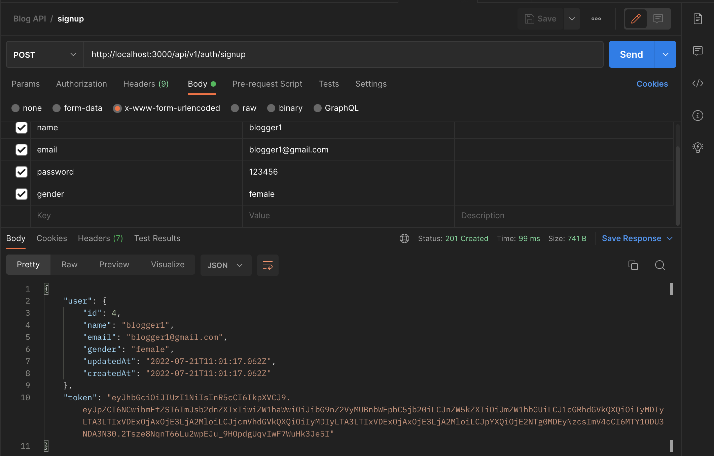
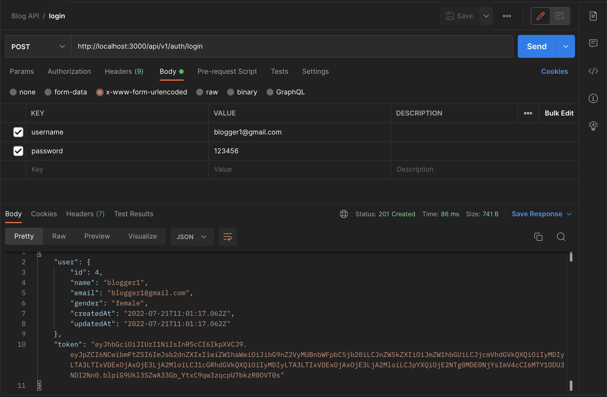

# Auth Module

## Generate Auth Module

This module will handle user authentication (Login and Sign up).

Run

```
nest generate module /modules/auth.
```

This will automatically add this module to our root module `AppModule`

## Generate Auth Service

Run

```
nest generate service /modules/auth.
```

This will automatically add this service to the `AuthModule`.

## Generate Auth Controller

Run

```
nest g co /modules/auth.
```

This will automatically add this controller to the `AuthModule`.

> **Note**: `g` is an alias for generate and `co` is for controller.

We will be using **Passport** to handle our authentication. It is straightforward to integrate this library with a Nest application using the `@nestjs/passport` module.

We will implement two auth strategies for this application:

**Local Passport Strategy**: This strategy will be used for logging in users. It will verify if the email/username and password provided by the user is valid or not. If user credentials are valid, it will return a token and user object, if not, it will throw an exception.

**JWT Passport Strategy**: This strategy will be used to protect protected resources. Only authenticated users with a valid token will be able to access these resources or endpoints.

## Local Passport Strategy

Run

```bash
npm install --save @nestjs/passport passport passport-local
npm install --save-dev @types/passport-local
npm install bcrypt --save
```

Inside the `auth` folder create a `local.strategy.ts` file and add the following code:

```typescript
import { Strategy } from "passport-local";
import { PassportStrategy } from "@nestjs/passport";
import { Injectable, UnauthorizedException } from "@nestjs/common";
import { AuthService } from "./auth.service";

@Injectable()
export class LocalStrategy extends PassportStrategy(Strategy) {
  constructor(private readonly authService: AuthService) {
    super();
  }

  async validate(username: string, password: string): Promise<any> {
    const user = await this.authService.validateUser(username, password);

    if (!user) {
      throw new UnauthorizedException("Invalid user credentials");
    }
    return user;
  }
}
```

<sup>`src/modules/auth/local.strategy.ts`</sup>

Here, we are importing `Strategy`, `PassportStrategy` and `AuthService`. We extend the `PassportStrategy` to create the `LocalStrategy`. In our use case with `passport-local`, there are no configuration options, so our constructor simply calls `super()` without any options object.

We must implement the `validate()` method. For the `local-strategy`, Passport expects a `validate()` method with the following signature: `validate(username: string, password:string): any`.

Most of the validation work is done in our `AuthService` (with the help of our `UserService`), so this method is quite straightforward.

We call the `validateUser()` method in the `AuthService` (we are yet to write this method), which checks if the user exists and if the password is correct. `authService.validateUser()` returns `null` if not valid or the user object if valid.

If a user is found and the credentials are valid, the user is returned so Passport can complete its tasks (e.g., creating the user property on the Request object), and the request handling pipeline can continue. If it's not found, we throw an exception and let our exceptions layer handle it.

Now, add the `PassportModule`, `UserModuleand` `LocalStrategy` to our `AuthModule`.

```typescript
import { Module } from "@nestjs/common";
import { PassportModule } from "@nestjs/passport";
import { AuthService } from "./auth.service";
import { AuthController } from "./auth.controller";
import { UsersModule } from "../users/users.module";
import { LocalStrategy } from "./local.strategy";

@Module({
  imports: [PassportModule, UsersModule],
  providers: [AuthService, LocalStrategy],
  controllers: [AuthController],
})
export class AuthModule {}
```

<sup>`src/modules/auth/auth.module.ts`</sup>

## AuthService

Let’s implement the `validateUser()` method.

```typescript
import { Injectable } from '@nestjs/common';
import \* as bcrypt from 'bcrypt';
import { UsersService } from '../users/users.service';

@Injectable()
export class AuthService {
constructor(private readonly userService: UsersService) { }

    async validateUser(username: string, pass: string) {
        // find if user exist with this email
        const user = await this.userService.findOneByEmail(username);
        if (!user) {
            return null;
        }

        // find if user password match
        const match = await this.comparePassword(pass, user.password);
        if (!match) {
            return null;
        }

        // tslint:disable-next-line: no-string-literal
        const { password, ...result } = user['dataValues'];
        return result;
    }

    private async comparePassword(enteredPassword, dbPassword) {
        const match = await bcrypt.compare(enteredPassword, dbPassword);
        return match;
    }

}
```

<sup>`src/modules/auth/auth.service.ts`</sup>

Here, we check if the user exists with the email provided. Then we check if the password in the DB matched what the User provided. If any of these checks fail, we return `null`, if not, we return the user object.

`comparePassword(enteredPassword, dbPassword)`: This private method compares the user-entered password and user DB password and returns a boolean. If the password matches it returns true. If not, it returns false.

## JWT Passport Strategy

Run

```bash
npm install @nestjs/jwt passport-jwt
npm install @types/passport-jwt --save-dev
```

Inside the `auth` folder create a `jwt.strategy.ts` file and add the following code:

```typescript
import { ExtractJwt, Strategy } from "passport-jwt";
import { PassportStrategy } from "@nestjs/passport";
import { Injectable, UnauthorizedException } from "@nestjs/common";
import { UsersService } from "../users/users.service";

@Injectable()
export class JwtStrategy extends PassportStrategy(Strategy) {
  constructor(private readonly userService: UsersService) {
    super({
      jwtFromRequest: ExtractJwt.fromAuthHeaderAsBearerToken(),
      ignoreExpiration: false,
      secretOrKey: process.env.JWTKEY,
    });
  }

  async validate(payload: any) {
    // check if user in the token actually exist
    const user = await this.userService.findOneById(payload.id);
    if (!user) {
      throw new UnauthorizedException(
        "You are not authorized to perform the operation"
      );
    }
    return payload;
  }
}
```

<sup>`src/modules/auth/jwt.strategy.ts`</sup>

Here, we are extending `PassportStrategy`. Inside the `super()` we added some options object. In our case, these options are:

`jwtFromRequest`: supplies the method by which the JWT will be extracted from the Request. We will use the standard approach of supplying a bearer token in the Authorization header of our API requests.

`ignoreExpiration`: just to be explicit, we choose the default false setting, which delegates the responsibility of ensuring that a JWT has not expired to the Passport module. This means that if our route is supplied with an expired JWT, the request will be denied and a 401 Unauthorized response sent. Passport conveniently handles this automatically for us.

`secretOrKey`: This is our secret key for the token. This will use the secret key in our `.env` file.
The `validate(payload: any)` For the `jwt-strategy`, Passport first verifies the JWT’s signature and decodes the JSON. It then invokes our `validate()` method passing the decoded JSON as its single parameter. Based on the way JWT signing works, we're guaranteed that we're receiving a valid token that we have previously signed and issued to a valid user. We confirm if the user exists with the user payload id. If the user exists, we return the user object, and Passport will attach it as a property on the Request object. If the user doesn’t exist, we throw an Exception.

Now, add the `JwtStrategy` and `JwtModule` to the `AuthModule`.:

```typescript
import { Module } from "@nestjs/common";
import { PassportModule } from "@nestjs/passport";
import { JwtModule } from "@nestjs/jwt";
import { AuthService } from "./auth.service";
import { AuthController } from "./auth.controller";
import { UsersModule } from "../users/users.module";
import { LocalStrategy } from "./local.strategy";
import { JwtStrategy } from "./jwt.strategy";

@Module({
  imports: [
    PassportModule,
    UsersModule,
    JwtModule.register({
      secret: process.env.JWTKEY,
      signOptions: { expiresIn: process.env.TOKEN_EXPIRATION },
    }),
  ],
  providers: [AuthService, LocalStrategy, JwtStrategy],
  controllers: [AuthController],
})
export class AuthModule {}
```

<sup>`src/modules/auth/auth.module.ts`</sup>

We configure the `JwtModule` using `register()`, passing in a configuration object.

Let’s add other methods we will need to login and create a new user in `AuthService`:

```typescript
import { Injectable } from '@nestjs/common';
import \* as bcrypt from 'bcrypt';
import { JwtService } from '@nestjs/jwt';
import { UsersService } from '../users/users.service';

@Injectable()
export class AuthService {
    constructor(
      private readonly userService: UsersService,
      private readonly jwtService: JwtService,
    ) { }

    async validateUser(username: string, pass: string) {
        // find if user exist with this email
        const user = await this.userService.findOneByEmail(username);
        if (!user) {
            return null;
        }

        // find if user password match
        const match = await this.comparePassword(pass, user.password);
        if (!match) {
            return null;
        }

        // tslint:disable-next-line: no-string-literal
        const { password, ...result } = user['dataValues'];
        return result;
    }

    public async login(user) {
        const token = await this.generateToken(user);
        return { user, token };
    }

    public async create(user) {
        // hash the password
        const pass = await this.hashPassword(user.password);

        // create the user
        const newUser = await this.userService.create({ ...user, password: pass });

        // tslint:disable-next-line: no-string-literal
        const { password, ...result } = newUser['dataValues'];

        // generate token
        const token = await this.generateToken(result);

        // return the user and the token
        return { user: result, token };
    }

    private async generateToken(user) {
        const token = await this.jwtService.signAsync(user);
        return token;
    }

    private async hashPassword(password) {
        const hash = await bcrypt.hash(password, 10);
        return hash;
    }

    private async comparePassword(enteredPassword, dbPassword) {
        const match = await bcrypt.compare(enteredPassword, dbPassword);
        return match;
    }

}
```

<sup>`src/modules/auth/auth.service.ts`</sup>

## Import and inject JwtService.

`login(user)`: This method is used to login the user. This takes the user information, generates a token with it, and then returns the token and user object.

`create(user)`: This method is used to create a new user. This takes the user information, hash the user password, saves the user to the DB, removes the password from the newly returned user, generates a token with the user object, and then returns the token and user object.

`generateToken(user)`: This private method generates a token and then returns it.

`hashPassword(password)`: This private method hashes the user password and returns the hashed password.

We will be using all these functions later.

## AuthController

Now, let’s create our signup and login methods:

```typescript
import { Controller, Body, Post, UseGuards, Request } from "@nestjs/common";
import { AuthGuard } from "@nestjs/passport";
import { AuthService } from "./auth.service";
import { UserDto } from "../users/dto/user.dto";

@Controller("auth")
export class AuthController {
  constructor(private authService: AuthService) {}

  @UseGuards(AuthGuard("local"))
  @Post("login")
  async login(@Request() req) {
    return await this.authService.login(req.user);
  }

  @Post("signup")
  async signUp(@Body() user: UserDto) {
    return await this.authService.create(user);
  }
}
```

<sup>`src/modules/auth/auth.controller.ts`</sup>

When we hit this endpoint `POST api/v1/auth/login` will call `@UseGuards(AuthGuard('local'))`. This will take the user email/username and password, then run the validate method on our local strategy class. The `login(@Request() req)` will generate a JWT token and return it.

The `POST api/v1/auth/signup` endpoint will call the `this.authService.create(user)` method, create the user, and return a JWT token.

## Let’s try it out…

Run

```bash
npm run start:dev
```

This runs the api server with a watch mode which reruns the server whenever a file is updated.

Now open your Postman application and make sure it's running. Send a `POST` request to `http://localhost:3000/api/v1/auth/signup` and input your body data to create a user. You should get a token and the user object returned.



Now that we have a user, let’s log the user in. Send a POST request to `http://localhost:3000/api/v1/auth/login` and input just your username and password. You should get a token and the user object returned.



Now we have a ready `AuthModule` and can move on to the [Next Step: Validation](./006%20validation.md)

---

### Further Read

- https://docs.nestjs.com/security/authentication
