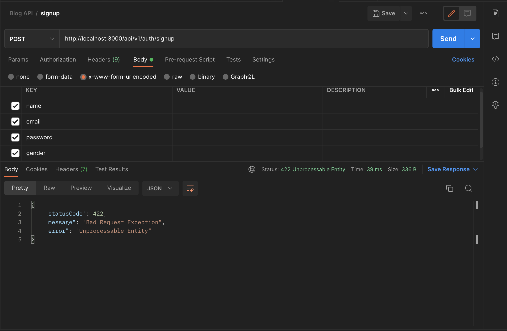
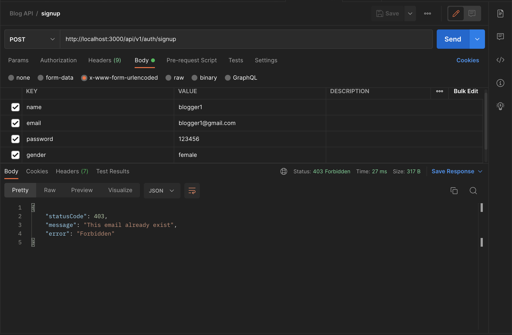

# Validation

Notice how we are not validating any of the user's input. Now, let’s add validation to our application.

Run

```
npm i class-validator class-transformer --save
```

Inside the `core` folder, create a `pipes` folder and then create `validate.pipe.ts` file. Copy and paste the following code:

```typescript
import {
  Injectable,
  ArgumentMetadata,
  BadRequestException,
  ValidationPipe,
  UnprocessableEntityException,
} from "@nestjs/common";

@Injectable()
export class ValidateInputPipe extends ValidationPipe {
  public async transform(value, metadata: ArgumentMetadata) {
    try {
      return await super.transform(value, metadata);
    } catch (e) {
      if (e instanceof BadRequestException) {
        throw new UnprocessableEntityException(e.message);
      }
    }
  }
}
```

<sup>`src/core/pipes/validate.pipe.ts`</sup>

Let’s auto-validate all our endpoints with dto by binding `ValidateInputPipe` at the application level. Inside the `main.ts` file, add this:

```typescript
import { NestFactory } from "@nestjs/core";
import { AppModule } from "./app.module";
import { ValidateInputPipe } from "./core/pipes/validate.pipe";

async function bootstrap() {
  const app = await NestFactory.create(AppModule);
  // global endpoints prefix
  app.setGlobalPrefix("api/v1");
  // handle all user input validation globally
  app.useGlobalPipes(new ValidateInputPipe());
  await app.listen(3000);
}
bootstrap();
```

<sup>`src/main.ts`</sup>

Now, let’s update our users dto file:

```typescript
import { IsNotEmpty, MinLength, IsEmail, IsEnum } from "class-validator";

enum Gender {
  MALE = "male",
  FEMALE = "female",
}

export class UserDto {
  @IsNotEmpty()
  readonly name: string;

  @IsNotEmpty()
  @IsEmail()
  readonly email: string;

  @IsNotEmpty()
  @MinLength(6)
  readonly password: string;

  @IsNotEmpty()
  @IsEnum(Gender, {
    message: "gender must be either male or female",
  })
  readonly gender: Gender;
}
```

<sup>`src/modules/users/dto/user.dto.ts`</sup>

Here, we are importing these decorators from `class-validator`.

`@IsNotEmpty()`: ensures the field isn’t empty.

`@IsEmail()`: checks if the email entered is a valid email address.

`@MinLength(6)`: ensures the password character is not less than six.

`@IsEnum`: ensures only the specified value is allowed (in this case, male and female).

`class-validator` has tons of validation decorators – check them out.

## Let’s try our validation out…



Without passing any value, We will get the following validation error. Our validation is working now. This validation is automatic to all endpoints with a dto (data transfer object).

## Unique User account

Let’s add a guard that prevents users from signing up with the same email twice since email is unique at the schema level.

Inside the `core` folder, create a `guards` folder, then create a `doesUserExist.guard.ts` file. Copy and paste the following code:

```typescript
import {
  CanActivate,
  ExecutionContext,
  Injectable,
  ForbiddenException,
} from "@nestjs/common";
import { Observable } from "rxjs";
import { UsersService } from "../../modules/users/users.service";

@Injectable()
export class DoesUserExist implements CanActivate {
  constructor(private readonly userService: UsersService) {}

  canActivate(
    context: ExecutionContext
  ): boolean | Promise<boolean> | Observable<boolean> {
    const request = context.switchToHttp().getRequest();
    return this.validateRequest(request);
  }

  async validateRequest(request) {
    const userExist = await this.userService.findOneByEmail(request.body.email);
    if (userExist) {
      throw new ForbiddenException("This email already exist");
    }
    return true;
  }
}
```

<sup>`src/core/guards/doesUserExist.guard.ts`</sup>

Now, let’s add this guard to our signup method in `AuthController`:

```typescript
import { Controller, Body, Post, UseGuards, Request } from "@nestjs/common";
import { AuthGuard } from "@nestjs/passport";
import { AuthService } from "./auth.service";
import { UserDto } from "../users/dto/user.dto";
import { DoesUserExist } from "../../core/guards/doesUserExist.guard";

@Controller("auth")
export class AuthController {
  constructor(private authService: AuthService) {}

  @UseGuards(AuthGuard("local"))
  @Post("login")
  async login(@Request() req) {
    return await this.authService.login(req.user);
  }

  @UseGuards(DoesUserExist)
  @Post("signup")
  async signUp(@Body() user: UserDto) {
    return await this.authService.create(user);
  }
}
```

<sup>`src/modules/auth/auth.controller.ts`</sup>

Let’s try to create a user with an email that already exists in our database:



Now we also have validation on our endpoints and we can move on to the [Next Step: Post Module](./007%20post-module.md)

---

### Further Read

- https://www.npmjs.com/package/class-validator
