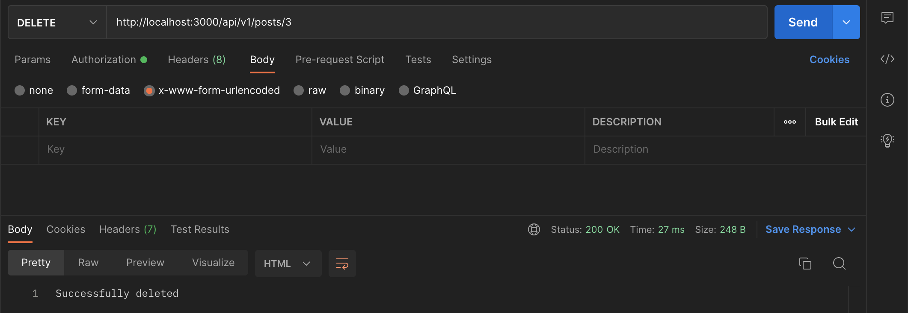

# Post Module

Run

```
nest g module /modules/posts
```

This will automatically add this module to our root module `AppModule`.

## Generate Post Service

Run

```
nest g service /modules/posts
```

This will automatically add this service to the `PostModule`.

## Generate Post Controller

Run

```
nest g co /modules/posts
```

This will automatically add this controller to the `PostModule`.

## Post Entity

Create a `post.entity.ts` file inside the posts folder. Copy and paste the following code:

```typescript
import {
  Table,
  Column,
  Model,
  DataType,
  ForeignKey,
  BelongsTo,
} from "sequelize-typescript";
import { User } from "../users/user.entity";

@Table
export class Post extends Model<Post> {
  @Column({
    type: DataType.STRING,
    allowNull: false,
  })
  title: string;

  @Column({
    type: DataType.TEXT,
    allowNull: false,
  })
  body: string;

  @ForeignKey(() => User)
  @Column({
    type: DataType.INTEGER,
    allowNull: false,
  })
  userId: number;

  @BelongsTo(() => User)
  user: User;
}
```

<sup>`src/modules/posts/post.entity.ts`</sup>

The only new thing here is the `@ForeignKey(() => User` specifying that the `userId` column is the id of the User table and `@BelongsTo(() => User)` specifying the relationship between the `Post` table and `User` table.

## Post DTO (Data Transfer Object)

Inside the `posts` folder, create a `dto` folder then create a `post.dto.ts` file inside it. Copy and paste the following code:

```typescript
import { IsNotEmpty, MinLength } from "class-validator";

export class PostDto {
  @IsNotEmpty()
  @MinLength(4)
  readonly title: string;

  @IsNotEmpty()
  readonly body: string;
}
```

<sup>`src/modules/posts/dto/post.dto.ts`</sup>

Here, our post body object must have a title, and body and title length must not be less than 4.

## Post Provider

Create a `posts.providers.ts` file inside the `posts` folder. Copy and paste the following code:

```typescript
import { Post } from "./post.entity";
import { POST_REPOSITORY } from "../../core/constants";

export const postsProviders = [
  {
    provide: POST_REPOSITORY,
    useValue: Post,
  },
];
```

<sup>`src/modules/posts/posts.providers.ts`</sup>

Add this `export const POST_REPOSITORY = 'POST_REPOSITORY';` to the constants `index.ts` file.

Add our Post provider to our `PostModule` file:

```typescript
import { Module } from "@nestjs/common";
import { PostsService } from "./posts.service";
import { PostsController } from "./posts.controller";
import { postsProviders } from "./posts.providers";

@Module({
  providers: [PostsService, ...postsProviders],
  controllers: [PostsController],
})
export class PostsModule {}
```

<sup>`src/modules/posts/posts.module.ts`</sup>

Now, add our Post entity to our database provider. Import the Post entity inside the `database.providers.ts` file, add the Post to this method:

```typescript
import { Post } from "src/modules/posts/post.entity";

...

sequelize.addModels([User, Post]);
```

## Post Service Methods

Copy and paste the following inside the Post service file:

```typescript
import { Injectable, Inject } from "@nestjs/common";
import { Post } from "./post.entity";
import { PostDto } from "./dto/post.dto";
import { User } from "../users/user.entity";
import { POST_REPOSITORY } from "../../core/constants";

@Injectable()
export class PostsService {
  constructor(
    @Inject(POST_REPOSITORY) private readonly postRepository: typeof Post
  ) {}

  async create(post: PostDto, userId): Promise<Post> {
    return await this.postRepository.create<Post>({ ...post, userId });
  }

  async findAll(): Promise<Post[]> {
    return await this.postRepository.findAll<Post>({
      include: [{ model: User, attributes: { exclude: ["password"] } }],
    });
  }

  async findOne(id): Promise<Post> {
    return await this.postRepository.findOne({
      where: { id },
      include: [{ model: User, attributes: { exclude: ["password"] } }],
    });
  }

  async delete(id, userId) {
    return await this.postRepository.destroy({ where: { id, userId } });
  }

  async update(id, data, userId) {
    const [numberOfAffectedRows] = await this.postRepository.update(
      { ...data },
      { where: { id, userId }, returning: true }
    );

    return numberOfAffectedRows;
  }
}
```

<sup>`src/modules/posts/posts.service.ts`</sup>

Here, we are injecting our Post repository to communicate with our database.

`create(post: PostDto, userId)`: This accepts post object and the id of the user creating the post. It adds the post to the database and returns the newly created Post. The PostDto is for validation.

`findAll()`: This gets all the posts from the database and also includes/eager load the user who created it while excluding the user password.

`findOne(id)`: This finds and returns the post with the id. It also includes/eager load the user who created it while excluding the user password.

`delete(id, userId)`: This deletes the post from the database with the id and userId. Only the user who created the post can delete it. This returns the number of rows that were affected.

`update(id, data, userId)`: This updates an existing post where id is the id of the post, data is the data to update, userId is the id of the original creator. This returns the number of rows that were updated and the newly updated object.

## Post Controller Methods

Copy and paste the following inside the Post controller file:

```typescript
import {
  Controller,
  Get,
  Post,
  Put,
  Delete,
  Param,
  Body,
  NotFoundException,
  UseGuards,
  Request,
} from "@nestjs/common";
import { AuthGuard } from "@nestjs/passport";
import { PostsService } from "./posts.service";
import { Post as PostEntity } from "./post.entity";
import { PostDto } from "./dto/post.dto";

@Controller("posts")
export class PostsController {
  constructor(private readonly postService: PostsService) {}

  @Get()
  async findAll() {
    // get all posts in the db
    return await this.postService.findAll();
  }

  @Get(":id")
  async findOne(@Param("id") id: number): Promise<PostEntity> {
    // find the post with this id
    const post = await this.postService.findOne(id);

    // if the post doesn't exit in the db, throw a 404 error
    if (!post) {
      throw new NotFoundException("This Post doesn't exist");
    }

    // if post exist, return the post
    return post;
  }

  @UseGuards(AuthGuard("jwt"))
  @Post()
  async create(@Body() post: PostDto, @Request() req): Promise<PostEntity> {
    // create a new post and return the newly created post
    return await this.postService.create(post, req.user.id);
  }

  @UseGuards(AuthGuard("jwt"))
  @Put(":id")
  async update(
    @Param("id") id: number,
    @Body() post: PostDto,
    @Request() req
  ): Promise<PostEntity> {
    // get the number of row affected
    const numberOfAffectedRows = await this.postService.update(
      id,
      post,
      req.user.id
    );

    // if the number of row affected is zero,
    // it means the post doesn't exist in our db
    if (numberOfAffectedRows === 0) {
      throw new NotFoundException("This Post doesn't exist");
    }

    // get the updated post
    const updatedPost = await this.postService.findOne(id);

    // return the updated post
    return updatedPost;
  }

  @UseGuards(AuthGuard("jwt"))
  @Delete(":id")
  async remove(@Param("id") id: number, @Request() req) {
    // delete the post with this id
    const deleted = await this.postService.delete(id, req.user.id);

    // if the number of row affected is zero,
    // then the post doesn't exist in our db
    if (deleted === 0) {
      throw new NotFoundException("This Post doesn't exist");
    }

    // return success message
    return "Successfully deleted";
  }
}
```

<sup>`src/modules/posts/posts.controller.ts`</sup>

Most of the CRUD operation functionality is done in our `PostService`.

`findAll()`: This handles GET request to `api/v1/posts` endpoint. It returns all the posts in our database.

`findOne(@Param(‘id’) id: number)`: This handles `GET` request to `api/v1/posts/1` endpoint to get a single post, where 1 is the id of the post. This throws a 404 error if it doesn’t find the post and returns the post object if it does find the post.

`create(@Body() post: PostDto, @Request() req)`: This handles `POST` request to `api/v1/posts` endpoint to create a new post.
`@UseGuards(AuthGuard(‘jwt’))` is used to protect the route (remember our JWT strategy). Only logged in users can create a post.

`update(@Param(‘id’) id: number, @Body() post: PostDto, @Request() req)`: This handles the `PUT` request to `api/v1/posts` endpoint to update an existing post. It is also a protected route. If the `numberOfAffectedRows` is zero that means no post with the params id was found.

`remove(@Param(‘id’) id: number, @Request() req)`: This handles the `DELETE` request to delete an existing post.

# Let’s try our CRUD operation out…

## Create a Post

Log in and add copy your token since creating a post route is a protected route.


Fill out the request body parameters


## Read a single Post

This route isn’t protected, so it can be accessed without the token.


## Reading all Posts

This route isn’t protected, so it can be accessed without the token too.


## Updating a Single Post

This route is protected, so we need a token and only the creator can update it.


## Deleting a Post

This route is protected, so we need a token and only the creator can delete it.



Now we have a ready `PostModule` and we can move on to the [Next Step: Swagger](./008%20swagger.md)
